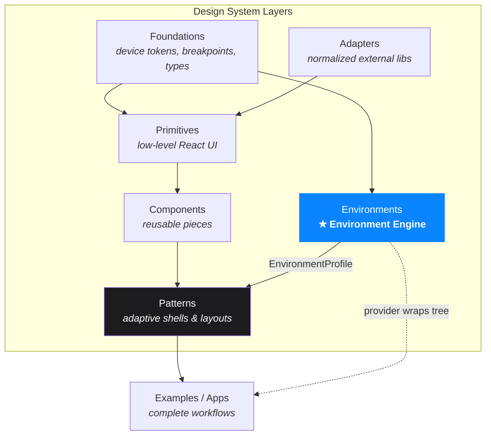
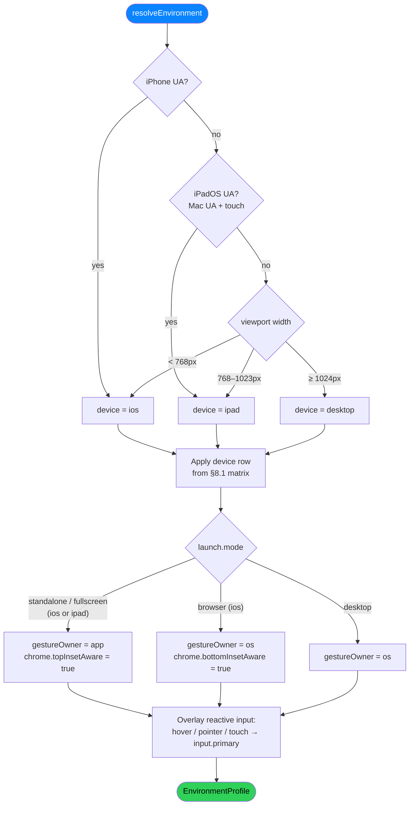
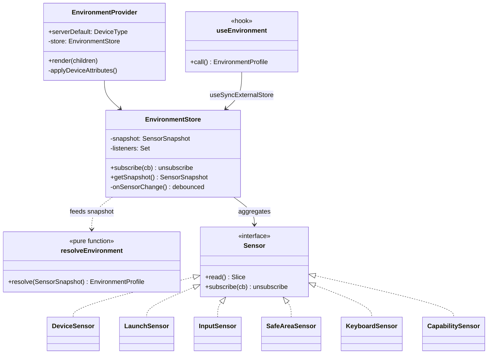
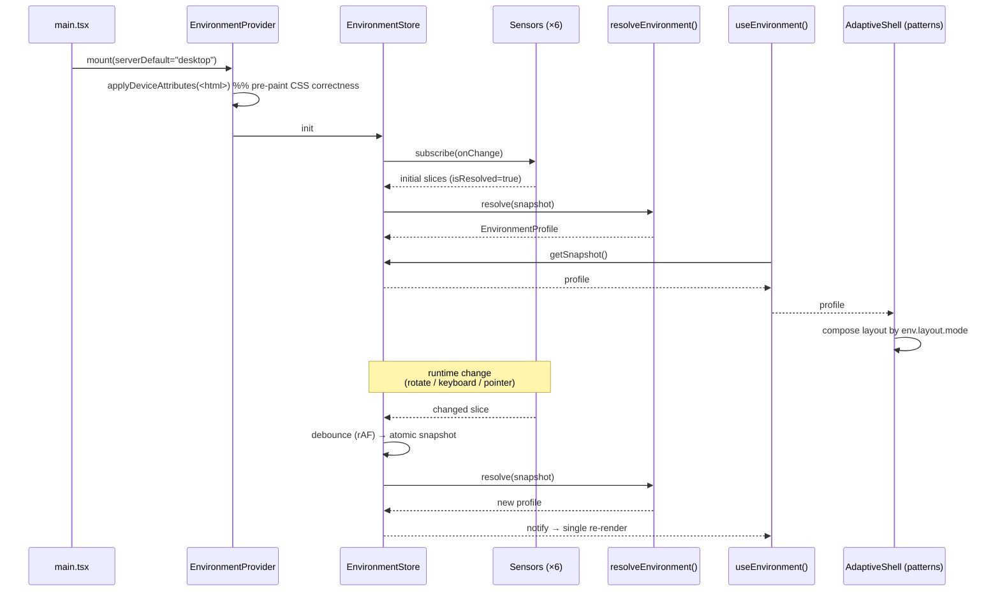
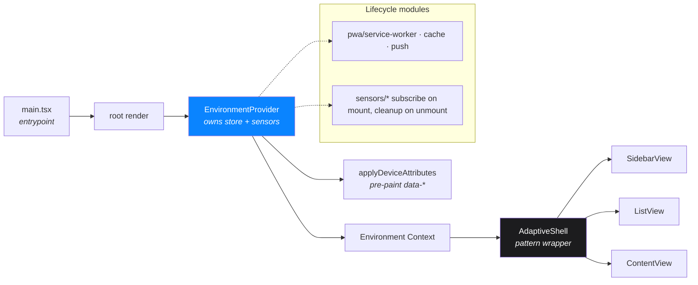
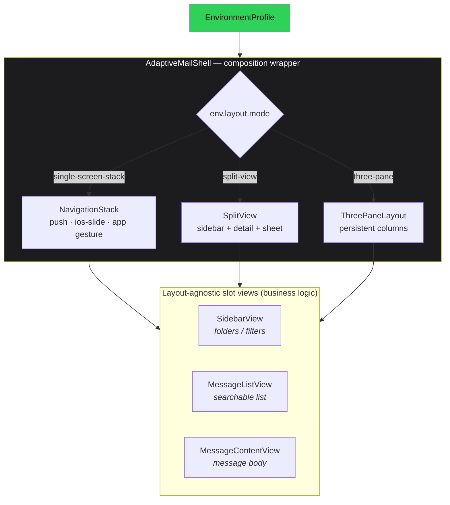

# Environment Engine — Product Specification & Feature Enhancement Project

| | |
|---|---|
| **Project** | Environment Engine (design-system runtime resolution layer) |
| **Owner** | Design System / Platform |
| **Status** | Approved for implementation |
| **Target layer** | `src/environments/` |
| **Parent initiative** | [Design System Folder Refactor — Section 6](/Users/kwaight/src/ai-conversations/web/todo/DesignSystemFolderRefactor.md) |
| **Progress log** | [refactor-changelog-notes.md](/Users/kwaight/src/ai-conversations/web/refactor-changelog-notes.md) |
| **Runtime** | Vite + React 19 + Storybook · Safari / Apple ecosystem only · PWA-first |

---

## 1. Executive Summary

The Environment Engine is the layer that converts raw runtime facts (device,
viewport, launch mode, input capability, safe-area insets, keyboard state, PWA
capabilities) into a single immutable **decision object** — the
`EnvironmentProfile`. UI patterns consume that object to compose themselves;
they never re-detect the platform.

This replaces the legacy approach where the app detected iOS once and only ever
tested the iOS PWA. As the system grows to span iPhone, iPad, and macOS — each
in both browser-tab and installed-PWA launch modes — scattered `isIOS() &&
isPWA() && !isDesktop()` checks become unmaintainable. The engine centralizes
that logic into one resolver with one data contract.

**The core rule:** the engine returns *decisions*, not UI. Patterns own
composition; components own local behavior. The same Mail-style shell becomes
iPhone → root → list → detail, iPad → sidebar + detail, desktop → three-pane,
purely by reading the resolved profile.

---

## 2. Background & Problem Statement

### 2.1 Current state

A reactive, SSR-safe detection layer already exists and must be **composed, not
rebuilt**:

- [foundations/device/device.ts](/Users/kwaight/src/ai-conversations/web/src/foundations/device/device.ts) — static breakpoints (`768` / `1024`), `matchMedia` query strings, and UA/hardware signals (`isIPhone`, `isIPadOS`, `isTouchDevice`, `isIOS`).
- [environments/device-detector.ts](/Users/kwaight/src/ai-conversations/web/src/environments/device-detector.ts) — `getDeviceType`, `getViewportClass`, `getDisplayMode`, `getLaunchMode`, `applyDeviceAttributes`.
- [environments/use-device.ts](/Users/kwaight/src/ai-conversations/web/src/environments/use-device.ts) — reactive hooks over `useSyncExternalStore` (no tearing, no hydration warning).

### 2.2 Gaps this project closes

| Gap | Impact |
|---|---|
| No `EnvironmentProfile` contract or resolver | Every component re-derives intent from booleans |
| No safe-area sensor (`env(safe-area-inset-*)`) | Notch / home-indicator / Dynamic-Island layouts are guesswork |
| No keyboard sensor (`visualViewport`) | Toolbars can't float above the iOS keyboard |
| No capability probe (SW, push, share, clipboard) | PWA features gated by ad-hoc checks |
| No per-environment profiles (`ipad/`, `pwa/` folders absent) | iPad and PWA behavior undefined |
| Scattered `matchMedia` listeners per hook | Redundant re-renders, layout thrash |

### 2.3 Decisions inherited (and why)

The architecture below synthesizes prior research into firm decisions:

- **Flat profile contract**, not a deeply nested one — easier to read, memoize, and diff.
- **Reactive input**, not static booleans — an iPad flips `hover:false → true` the instant a Magic Keyboard/Pencil engages.
- **One coordinated store**, not N sensor listeners — prevents thrash.
- **Standalone PWA owns its back gesture** — Safari disables edge-swipe back in standalone, so the engine must signal when the app must inject a recognizer.
- **No SSR in this runtime** — first paint is made correct by pre-paint `data-*` attributes + CSS, with an `isResolved` flag as the JS-only guard.

---

## 3. Goals & Non-Goals

### 3.1 Goals

- **G1** — A single, immutable, reactive `EnvironmentProfile` resolved from all runtime facts.
- **G2** — Full coverage of iPhone, iPad, desktop × (browser tab | installed PWA).
- **G3** — PWA-grade surface awareness: safe-area, keyboard inset, display-mode chrome.
- **G4** — A clean consumption API (`useEnvironment()` + slice hooks) with zero direct `matchMedia`/`navigator` use in components.
- **G5** — Deterministic, unit-testable resolution (pure resolver function).

### 3.2 Non-Goals

- **NG1** — Rendering UI. The engine returns data only.
- **NG2** — Building `AdaptiveShell` / `NavigationStack` / `SplitView` containers — those live in `src/patterns/` (refactor §5).
- **NG3** — Implementing gestures. The engine *signals* the requirement; the pattern layer recognizes the gesture.
- **NG4** — Supporting non-Safari browsers or non-Apple platforms.
- **NG5** — Server-side rendering. The runtime is a Vite/Storybook client package.

---

## 4. Target Environment Matrix

| Environment | Screen strategy | Input | PWA notes |
|---|---|---|---|
| **iPhone — Safari tab** | Single-column stack; search at bottom; tight Safari sandbox | Touch | Bottom URL-bar inset-aware; AddToHomeScreen candidate |
| **iPhone — installed PWA** | Single-column stack; owns full screen incl. notch | Touch | No OS back-swipe → app owns gesture; expanded container |
| **iPad — Safari tab** | Split-view capable; more room than iPhone | Touch (+ pointer) | Same Safari limits, less cramped |
| **iPad — installed PWA** | Near-native split-view; sidebar + detail | Touch ↔ hybrid (Pencil/trackpad) | Isolated window; app owns back gesture |
| **macOS — Safari / desktop web** | Three-pane persistent layout | Pointer + keyboard | High-performance productive surface |
| **macOS — installed PWA** | Three-pane; multi-window capable | Pointer + keyboard | Windowing = multi-window |

---

## 5. User Stories

> Format: **As a** _persona_, **I want** _capability_, **so that** _outcome_.
> Each carries acceptance criteria (AC).

**US-1 — Adaptive shell author**
As a pattern developer, I want one resolved profile object, so that I compose
layout from `env.layout.mode` instead of branching on device booleans.
- AC1: `useEnvironment()` returns a fully-typed `EnvironmentProfile`.
- AC2: No pattern reads `matchMedia`, `navigator`, or UA strings directly.

**US-2 — iPhone PWA user**
As an iPhone PWA user, I want screens to slide naturally and respect the notch
and home indicator, so that the app feels native.
- AC1: `surface.safeArea` returns non-zero insets on notched hardware in standalone.
- AC2: `navigation.transition === "ios-slide"`, `navigation.mode === "push-stack"`.

**US-3 — iPhone PWA user with keyboard open**
As an iPhone PWA user typing in a field, I want toolbars to float above the
keyboard, so that controls stay reachable.
- AC1: `surface.keyboard.visible === true` and `height > 0` while the soft keyboard is open.
- AC2: The value updates on `visualViewport` resize without a full remount.

**US-4 — iPad multitasking user**
As an iPad user, I want the layout to react when I attach a Magic Keyboard or
use a Pencil, so that hover/pointer affordances appear live.
- AC1: Attaching a trackpad flips `input.hover`/`input.finePointer` to `true` and `input.primary` to `"hybrid"`.
- AC2: No more than one re-render per capability change.

**US-5 — Desktop user**
As a macOS user, I want a persistent three-pane layout with keyboard back
behavior, so that the app is productive.
- AC1: `layout.mode === "three-pane"`, `navigation.backBehavior === "escape-key"`.

**US-6 — Returning standalone-PWA user**
As a standalone-PWA user, I want back navigation to work even though Safari's
edge-swipe is disabled, so that the app never feels frozen.
- AC1: In standalone, `navigation.gestureOwner === "app"`; in a Safari tab it is `"os"`.

**US-7 — Feature-gating developer**
As a developer, I want to know which PWA capabilities are present, so that I can
gate share/push/offline features safely.
- AC1: `capabilities` reports `serviceWorker`, `push`, `notifications`, `clipboard`, `canShare` accurately.

**US-8 — First-paint quality**
As any user, I want the correct layout on first paint, so that I never see a
desktop→mobile snap.
- AC1: `<html>` carries `data-device/-viewport/-display-mode` before React paints.
- AC2: `isResolved` is `false` on first client render, `true` after hydration; JS-only adaptive mounts gate on it.

---

## 6. Requirements

### 6.1 Functional Requirements

- **FR-1** Expose an immutable `EnvironmentProfile` (see §9) from a single provider.
- **FR-2** Resolve `device`, `viewport`, `orientation`, and `launch` by composing the existing detectors — no re-implementation.
- **FR-3** Provide four net-new sensors: `input`, `safe-area`, `keyboard`, `capability` (see §10).
- **FR-4** Apply the device→intent resolution matrix (§8) plus launch-context overrides.
- **FR-5** Set `navigation.gestureOwner = "app"` in any standalone display-mode on iOS/iPad.
- **FR-6** Recompute the profile reactively on: width/orientation change, display-mode change, pointer/hover change, safe-area change, and `visualViewport` change.
- **FR-7** Coalesce all signal changes into one debounced (rAF) atomic store update.
- **FR-8** Reflect device state onto `<html>` as `data-*` attributes for pre-paint CSS.
- **FR-9** Provide `useEnvironment()` plus memoized slice hooks (`useEnvironmentLayout`, `useSafeArea`, `useKeyboardInset`).
- **FR-10** Carry `isResolved` to distinguish first-paint default from resolved state.

### 6.2 Non-Functional Requirements

- **NFR-1 Purity** — `resolveEnvironment()` is a pure function (no React, no DOM, no side effects); fully unit-testable.
- **NFR-2 Performance** — ≤ 1 re-render per discrete capability change; no polling; listeners cleaned up on unmount.
- **NFR-3 Isolation** — all browser-API access lives inside `environments/`; components depend only on hooks.
- **NFR-4 Type safety** — `tsc -b`, Biome lint, and Vitest all green; no `any` in the public contract.
- **NFR-5 Safari-only** — no code paths for other engines. `bridgeType` is a wrapper-integration tag, not an engine check (see §8.2): `webkit` for the iOS/iPad WKWebView surface, `standard-web` for desktop.
- **NFR-6 SSR-safety** — every sensor degrades to a server/first-paint default without throwing.

---

## 7. Architecture & Layer Model

The Environment Engine sits in the `environments/` layer of the design system.
It depends *down* on `foundations/device` and is consumed *up* by `patterns/`.



### 7.1 Layer responsibilities

| Layer | **Responsible for** | **Must NOT do** |
|---|---|---|
| **Foundations / device** | Classification vocabulary: `DeviceType`, `ViewportClass`, `LaunchMode`, breakpoints, `matchMedia` query strings, static UA/hardware signals | Hold runtime state, subscribe to events, or render React |
| **Environment Engine** (this project) | Read runtime facts via sensors, resolve them into `EnvironmentProfile`, expose reactive hooks | Render UI, own navigation state, recognize gestures, hold app data |
| **Patterns** | Consume the profile, compose `AdaptiveShell` / `NavigationStack` / `SplitView`, own pane visibility + back behavior + gesture recognizers | Re-detect the platform, read `matchMedia`/`navigator` |
| **Components** | Local behavior (swipe actions, pressed/selected/hover state, density variants, a11y labels) | Decide "am I on iPhone?" or whether a pane should appear |
| **Examples / Apps** | Mount `EnvironmentProvider`, supply slot views to patterns | Implement detection logic |

### 7.2 The decision/composition/visual split

```text
Foundations  = source data         (what kinds of device exist)
Engine       = decision layer      (given the facts, how should UI behave)
Patterns     = composition layer   (arrange panes per the decision)
Components    = visual layer        (render a row, a button, a field)
```

---

## 8. Environment Resolution — Decision Tree



### 8.1 Resolution matrix (device → intent)

| Field | **iOS (iPhone)** | **iPad** | **Desktop** |
|---|---|---|---|
| `layout.mode` | `single-screen-stack` | `split-view` | `three-pane` |
| `layout.density` | `compact` | `regular` | `expanded` |
| `layout.sidebar` | `root-view` | `collapsible` | `persistent` |
| `layout.list` | `stack-view` | `persistent` | `persistent` |
| `layout.content` | `stack-view` | `detail-pane` | `persistent` |
| `layout.inspector` | `sheet` | `sheet` | `side-panel` |
| `navigation.mode` | `push-stack` | `split-popover` | `multi-pane` |
| `navigation.transition` | `ios-slide` | `fade-scale` | `none` |
| `navigation.backBehavior` | `edge-swipe` | `button` | `escape-key` |

### 8.2 Launch-context overrides (applied after the device row)

| Condition | Override |
|---|---|
| iOS/iPad **standalone** | `navigation.gestureOwner = "app"`; `surface.chrome.topInsetAware = true` |
| iOS **Safari tab** | `navigation.gestureOwner = "os"`; `surface.chrome.bottomInsetAware = true` |
| iPad with **fine pointer** present | `input.primary = "hybrid"` (keep `backBehavior = button`) |
| Desktop with **coarse pointer** | keep `three-pane`; set `input.touch = true` |
| `windowingMode` | `multi-window` (desktop PWA) · `isolated` (iOS/iPad standalone) · `tabbed` (otherwise) |
| `bridgeType` | `webkit` on iOS/iPad · `standard-web` on desktop. The field tags the *integration surface* a future native wrapper would target (iOS/iPad ship inside a WKWebView shell; desktop is treated as a plain web target), **not** the rendering engine — so a Safari-only program still reports `standard-web` for desktop. |

---

## 9. Data Models

### 9.1 Vocabulary (lives in `foundations/device/device.types.ts`)

```ts
export type DeviceType    = "ios" | "ipad" | "desktop";
export type ViewportClass = DeviceType;                       // width-only alias
export type Orientation   = "portrait" | "landscape";
export type DisplayMode   = "browser" | "standalone" | "fullscreen" | "minimal-ui";
export type LaunchMode    = "browser" | "standalone" | "pwa"; // string union

/** The existing object type is renamed `LaunchState` to free `LaunchMode`. */
export interface LaunchState {
  isPWA: boolean;
  isSafariBrowser: boolean;
  isIOS: boolean;
  displayMode: DisplayMode;
}
```

### 9.2 The contract (`environments/environment.types.ts`)

```ts
export type InputPrimary  = "touch" | "hybrid" | "keyboard-pointer";
export type LayoutMode    = "single-screen-stack" | "split-view" | "three-pane";
export type Density       = "compact" | "regular" | "expanded";
export type SidebarMode   = "root-view" | "collapsible" | "persistent";
export type PaneMode      = "stack-view" | "detail-pane" | "persistent";
export type InspectorMode = "hidden" | "sheet" | "side-panel";
export type NavigationMode = "push-stack" | "split-popover" | "multi-pane";
export type Transition    = "ios-slide" | "fade-scale" | "none";
export type BackBehavior  = "edge-swipe" | "button" | "escape-key" | "breadcrumb";
export type GestureOwner   = "os" | "app";        // "app" ⇒ patterns inject a recognizer
export type WindowingMode  = "isolated" | "tabbed" | "multi-window";
export type BridgeType     = "webkit" | "standard-web";

export interface EnvironmentProfile {
  device: DeviceType;
  viewport: ViewportClass;
  orientation: Orientation;
  launch: { mode: LaunchMode; displayMode: DisplayMode };

  input: {
    primary: InputPrimary;
    touch: boolean;
    hover: boolean;
    keyboard: boolean;
    coarsePointer: boolean;
    finePointer: boolean;
  };

  layout: {
    mode: LayoutMode;
    density: Density;
    sidebar: SidebarMode;
    list: PaneMode;
    content: PaneMode;
    inspector: InspectorMode;
  };

  navigation: {
    mode: NavigationMode;
    transition: Transition;
    backBehavior: BackBehavior;
    gestureOwner: GestureOwner;
  };

  surface: {
    safeArea: { top: number; right: number; bottom: number; left: number };
    keyboard: { visible: boolean; height: number; offset: number };
    chrome:   { topInsetAware: boolean; bottomInsetAware: boolean };
  };

  capabilities: {
    pwa: boolean;
    serviceWorker: boolean;
    offlineCache: boolean;
    push: boolean;
    notifications: boolean;
    clipboard: boolean;
    canShare: boolean;
    windowingMode: WindowingMode;
    bridgeType: BridgeType;
  };

  isResolved: boolean;   // false on first client render, true after hydration
}
```

### 9.3 Sensor snapshot (resolver input)

```ts
export interface SensorSnapshot {
  device: { type: DeviceType; viewport: ViewportClass; orientation: Orientation };
  launch: { mode: LaunchMode; displayMode: DisplayMode };
  input:  Pick<EnvironmentProfile["input"], "touch" | "hover" | "keyboard" | "coarsePointer" | "finePointer">;
  safeArea: EnvironmentProfile["surface"]["safeArea"];
  keyboard: EnvironmentProfile["surface"]["keyboard"];
  capability: Omit<EnvironmentProfile["capabilities"], "windowingMode" | "bridgeType">;
  isResolved: boolean;
}
```

---

## 10. Module & Class Responsibilities



### 10.1 Module contract table

| Module | Responsibility | Must NOT |
|---|---|---|
| `environment-engine.ts` → `resolveEnvironment()` | Pure `SensorSnapshot → EnvironmentProfile` mapping; owns the §8 matrix + overrides | Touch the DOM, use React, subscribe to events |
| `EnvironmentProvider.tsx` | Wire sensors into one store, run `applyDeviceAttributes`, supply context | Hold app/business state or render layout |
| `EnvironmentStore` | Aggregate sensor slices, debounce to one atomic snapshot, fan out to subscribers | Map facts to intent (that's the resolver) |
| `use-environment.ts` hooks | Read the profile / memoized slices via `useSyncExternalStore` | Re-detect anything |
| `sensors/device-sensor.ts` | Wrap `getDeviceType` / `getViewportClass` + orientation | Re-implement breakpoint logic |
| `sensors/launch-sensor.ts` | Wrap `getLaunchMode` / `getDisplayMode` | — |
| `sensors/input-sensor.ts` | Live `matchMedia` hover/pointer/coarse → `InputPrimary` | Cache stale booleans |
| `sensors/safe-area-sensor.ts` | Read `env(safe-area-inset-*)` via probe + `ResizeObserver` | Assume static insets |
| `sensors/keyboard-sensor.ts` | `visualViewport` height/offset → keyboard inset | Poll on a timer |
| `sensors/capability-sensor.ts` | Probe SW / push / notifications / clipboard / share | Request permissions |
| `profiles/{ios,ipad,desktop}.ts` | Encode each device row of the matrix | Subscribe to events |
| `pwa/{manifest,service-worker,cache,push}.ts` | PWA lifecycle stubs; surface availability to `capabilities` | Block first paint |

---

## 11. Operating Model — Reactive Data Flow



### 11.1 Application entrypoint & lifecycle



---

## 12. Component Wrapper Model (business-logic isolation)

The pattern container is the only place that knows the profile. Slot views are
**layout-agnostic** — they receive data and emit callbacks; the wrapper decides
where they live and how they transition.



**Wrapper owns:** active pane, navigation depth, selection state, back
behavior, gesture transition, pane visibility/width, safe-area handling,
route/state sync.
**Slot view owns:** its own data fetch, row swipe actions, pressed/selected
state, a11y labels, density variants. It must **not** decide "am I on iPhone?",
"should the sidebar disappear?", or "should this open a new pane?".

---

## 13. Engineering Plan

> **Working agreement**
> - Branch off `main`; never commit to `main` directly.
> - Each turn, record findings/decisions/deviations in [refactor-changelog-notes.md](/Users/kwaight/src/ai-conversations/web/refactor-changelog-notes.md) under a new `## Phase 6: Build the Environment Engine` heading, matching the existing phase style.
> - Flip `- [ ]` → `- [x]` in this file as tasks complete, every turn; keep this list and the changelog in sync.
> - After any change run `pnpm run typecheck && pnpm run lint && pnpm run test`; do not report a task done while any fails.
> - Reuse the existing detectors — wrap, never reinvent (§2.1).

### Phase A — Contracts & reconciliation

- [x] Update `foundations/device/device.types.ts`: add `ViewportClass`, string-union `LaunchMode`, rename existing object to `LaunchState`; fix barrels (§9.1).
- [x] Author `environments/environment.types.ts` exactly per §9.2 + `SensorSnapshot` per §9.3.
- [x] Implement first-paint per §5/US-8: `applyDeviceAttributes` + CSS primary, `isResolved` guard secondary.

### Phase B — Sensors (net-new only)

- [x] `sensors/input-sensor.ts` — reactive hover/pointer/coarse → `InputPrimary`.
- [x] `sensors/safe-area-sensor.ts` — `env(safe-area-inset-*)` via probe + `ResizeObserver`.
- [x] `sensors/keyboard-sensor.ts` — `visualViewport` → `{visible,height,offset}`.
- [x] `sensors/capability-sensor.ts` — SW / push / notifications / clipboard / share.
- [x] `sensors/{device,launch}-sensor.ts` — thin wrappers over existing detectors.

### Phase C — Engine, store, provider & profiles

- [x] `environment-engine.ts` — pure `resolveEnvironment(SensorSnapshot)` implementing §8 + §8.2.
- [x] `EnvironmentStore` + `EnvironmentProvider.tsx` — one debounced subscription, atomic snapshot, `applyDeviceAttributes`.
- [x] `use-environment.ts` — `useEnvironment()` + `useEnvironmentLayout` / `useSafeArea` / `useKeyboardInset`.
- [x] `profiles/{ios,ipad,desktop}.ts` — encode matrix rows (create `ipad/`).
- [x] `pwa/` — stub `manifest.ts` / `service-worker.ts` / `cache.ts` / `push.ts`; feed `capabilities` (create `pwa/`).
- [x] Update `environments/index.ts` to export engine, provider, hooks, types.

### Phase D — Story, docs & validation

- [x] `Environments/Environment Engine` Storybook story showing live device, viewport, launch, safe-area, keyboard, capabilities, resolved profile.
- [x] Update [Environments.mdx](/Users/kwaight/src/ai-conversations/web/src/environments/Environments.mdx) to the final contract + folder layout.
- [x] Resolution tests across every §8 row + override (see §14).
- [x] Green `typecheck` + `lint` + `test`; flip refactor §6 boxes in [DesignSystemFolderRefactor.md](/Users/kwaight/src/ai-conversations/web/todo/DesignSystemFolderRefactor.md).

### Out of scope (later phases)

- [ ] `AdaptiveShell` / `NavigationStack` / `SplitView` containers — `src/patterns/` (refactor §5).
- [ ] Gesture library choice (`@use-gesture/react` vs. hand-rolled Pointer Events) — flag in changelog; defer to pattern phase.

---

## 14. Testing & Acceptance

| Test area | Asserts |
|---|---|
| Resolver matrix | Every §8 device row → expected layout/navigation fields |
| Launch overrides | Standalone → `gestureOwner="app"`; Safari tab → `"os"` + bottom chrome |
| Input reactivity | Trackpad attach flips `hover`/`finePointer`/`primary`; ≤ 1 re-render |
| Safe-area | Non-zero insets on simulated notched standalone |
| Keyboard | `visible=true`, `height>0` on simulated `visualViewport` shrink |
| Capabilities | Accurate SW/push/clipboard/share booleans |
| Boundary | No component imports `matchMedia`/`navigator` directly (lint/architecture test) |
| First paint | `<html>` data-attributes set pre-paint; `isResolved` false→true |

---

## 15. Risks & Mitigations

| Risk | Mitigation |
|---|---|
| Re-implementing existing detection | Phase B/C explicitly wrap `device-detector.ts` / `use-device.ts` |
| Layout thrash from many listeners | Single debounced store (FR-7) |
| First-paint snap | Pre-paint `data-*` + CSS; `isResolved` guard (US-8) |
| Standalone PWA "frozen" back | `gestureOwner="app"` signal (FR-5, US-6) |
| Static input booleans go stale | Live `matchMedia` input sensor (US-4) |
| Gesture lib not installed (`@use-gesture`, `react-aria-components` absent) | Engine only *signals*; lib choice deferred to pattern phase |
| Type-name collision (`LaunchMode`) | Rename to `LaunchState` in Phase A (§9.1) |

---

## 16. Reference Files

**Project tracking**
- [DesignSystemFolderRefactor.md](/Users/kwaight/src/ai-conversations/web/todo/DesignSystemFolderRefactor.md) — parent refactor, §6 owns this work.
- [refactor-changelog-notes.md](/Users/kwaight/src/ai-conversations/web/refactor-changelog-notes.md) — progress log.

**Existing implementation (compose, do not rebuild)**
- [foundations/device/device.ts](/Users/kwaight/src/ai-conversations/web/src/foundations/device/device.ts) · [device.types.ts](/Users/kwaight/src/ai-conversations/web/src/foundations/device/device.types.ts) · [Device.mdx](/Users/kwaight/src/ai-conversations/web/src/foundations/device/Device.mdx)
- [environments/device-detector.ts](/Users/kwaight/src/ai-conversations/web/src/environments/device-detector.ts) · [use-device.ts](/Users/kwaight/src/ai-conversations/web/src/environments/use-device.ts) · [Environments.mdx](/Users/kwaight/src/ai-conversations/web/src/environments/Environments.mdx)

---

## 17. Implementation Status

**Delivered — Phase 6 complete.** The Environment Engine is implemented under
`src/environments/` (`environment.types.ts`, `environment-engine.ts`,
`sensors/`, `profiles/`, `pwa/`, `EnvironmentProvider.tsx`, `use-environment.ts`,
`EnvironmentEngine.stories.tsx`). Verified gates: `tsc -b` clean, Biome clean
(26 files), `vitest --project unit` 5/5 passing.

- **Implementation report:** [todo/reports/phase6-environment-engine-implementation-report.md](/Users/kwaight/src/ai-conversations/web/todo/reports/phase6-environment-engine-implementation-report.md)
- **Changelog entry:** [refactor-changelog-notes.md](/Users/kwaight/src/ai-conversations/web/refactor-changelog-notes.md) — Phase 6.
